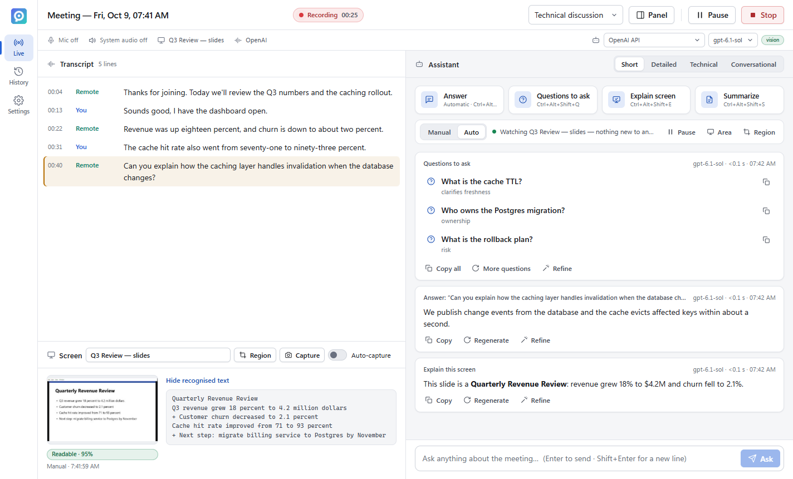
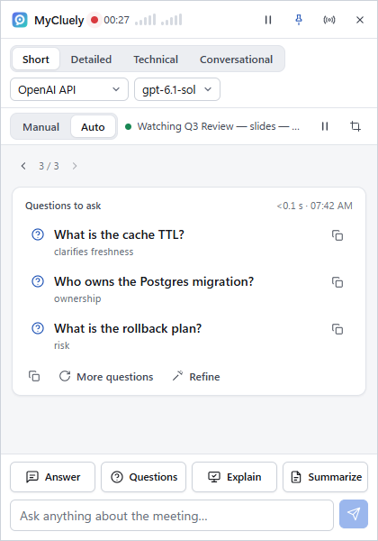
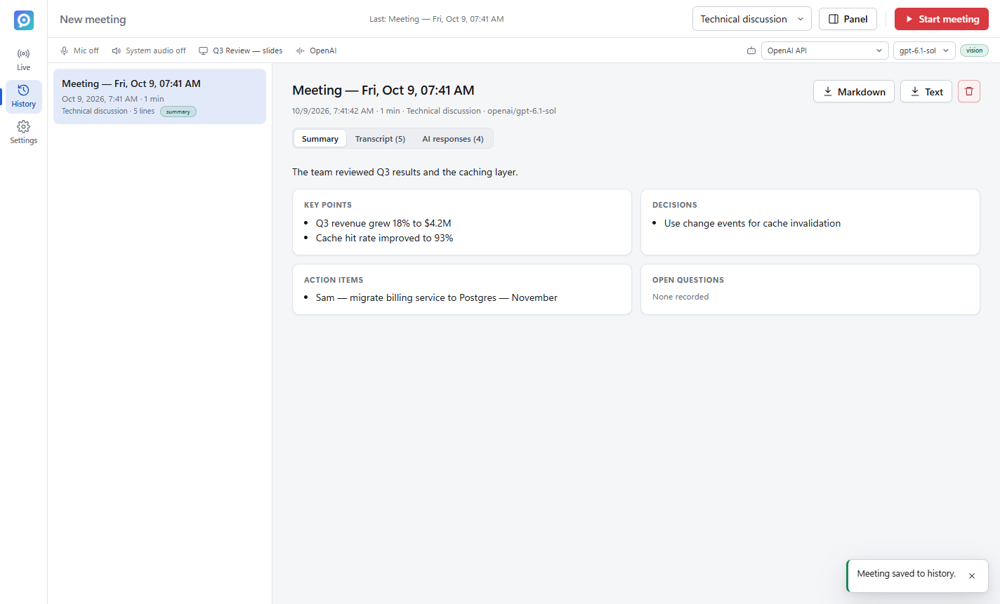
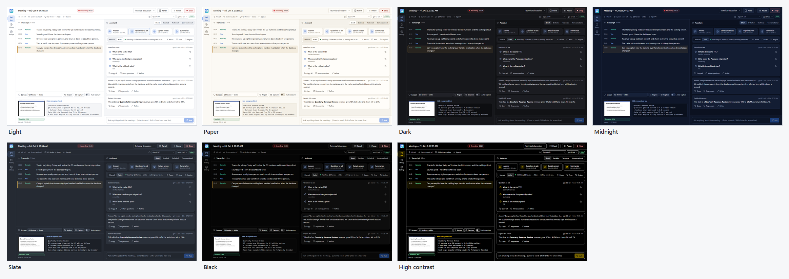
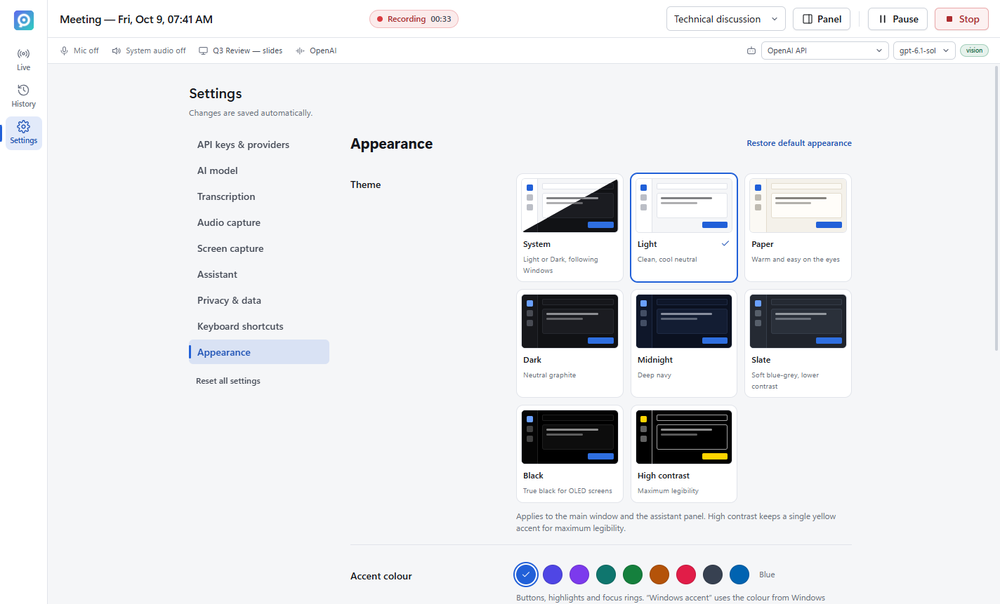

# MyCluely — real-time meeting assistant for Windows

MyCluely listens to your meetings (your microphone **and** the meeting audio playing on your PC), reads what is on your screen, and gives you short, grounded text help while you talk: answers to the question you were just asked, explanations of the slide or code being shown, smart follow-up questions, and live summaries. Works with **OpenAI, Anthropic (Claude), Google Gemini, Moonshot AI (Kimi) and DeepSeek** — bring your own API key, or **use your ChatGPT Plus/Pro plan** with no API charges.



| Assistant panel (always on top) | Meeting history |
| --- | --- |
|  |  |

**Seven themes**, nine accent colours (including your Windows accent), compact or comfortable density, rounded or square corners and four fonts — *Settings → Appearance*:



<details><summary>Appearance settings</summary>



</details>

## Features

**Meeting audio**
- Captures your microphone ("You") and Windows system audio ("Remote") — works with Teams, Zoom, Google Meet, Webex or anything else that plays through your PC.
- Continuous transcription with voice-activity segmentation. Engines: **on-device Whisper** (free, private, runs on your GPU via WebGPU or CPU), **OpenAI** (`gpt-transcribe`, optional speaker separation with `gpt-4o-transcribe-diarize`) or **Gemini**.
- Speaker labels by channel (You / Remote, optionally Remote A / B), echo suppression when you use speakers, filtering of speech-to-text hallucinations.
- Start / pause / resume / stop, live level meters, automatic recovery when a device is unplugged.

**Screen understanding**
- Capture a whole screen, a specific window, or a dragged region; manually or automatically every N seconds. Unchanged screens are skipped, but any changed line of text (next slide, scrolling, edited code) is picked up.
- Local OCR (Tesseract) tuned for screens: dark themes are inverted before reading, junk from icons and toolbars is dropped, and each capture gets a readability rating — *Readable / Partly readable / Unreadable* — so the assistant (and you) know when screen content is unreliable. Vision-capable models also receive the screenshot for *Explain this screen* and whenever the text is hard to read.
- MyCluely's own windows are masked out of captures so it never reads its own answers.

**Live AI assistance**
- **Answer the latest question**, **Questions to ask**, **Explain this screen**, **Summarize the discussion**, **Ask anything**.
- **Questions to ask** writes three specific questions you could ask the other participants, based on what was said (and the screen): to clarify, move things forward or surface risks and owners. Each has a one-click copy button; **More questions** gives new ones without repeating earlier suggestions.
- Short, detailed, technical or conversational answers; streamed as they are generated; **Stop**, **Regenerate** and **Refine** (shorter, more detail, simpler, more formal, or your own instruction).
- **Built for speed:** *Response speed → Fastest* (the default) has the model answer without extended thinking and sends screenshots only for *Explain this screen*; connections to the AI provider stay open between answers and are opened ahead of time when a meeting starts or a question is asked; model details never hold up a request. Each answer card shows how long it took to start (hover for the full time).
- **Answer mode: Manual or Auto** (in the Assistant pane and the floating panel).
  - **Manual:** nothing is answered until you click **Answer** or press the shortcut. *Answer* answers the question just asked aloud; if none was, it takes a fresh look at the screen and answers the most recent question — spoken or shown.
  - **Auto:** questions asked by other participants are answered as soon as they are asked, and the selected **screen, window or region is watched**: when something new appears and the screen stops changing, it is read (OCR, plus the screenshot for vision models) and visible questions, problems, multiple-choice items, code or messages to reply to are answered — using the meeting conversation and the previous screen for context. Unchanged content is never answered twice, screens that keep moving (video in a call) are answered once their text is stable, MyCluely's own windows are never read, and unreadable or cut-off content is reported instead of guessed. A status line shows what is being watched (*Watching…*, *Screen changed — waiting for it to settle…*, *Answering…*, *Can't read the screen…*), with **Pause / Resume**, **Area** and **Region** controls.
  - Automatic answers never overlap; a question that appears during the short gap between answers (10 s by default) is answered right after it, not skipped. Answers appear in the panel straight away (it opens without taking focus). MyCluely only shows answers — it never types, submits forms or sends messages.
- Grounded prompts: meeting facts come only from the transcript/screen; uncertainty and unreadable input are called out.
- Meeting types: general, technical discussion, standup, client meeting — each tunes the assistant.

**Providers and models**
- OpenAI (Responses API), Anthropic (Messages API), Google Gemini (Gemini API), Moonshot/Kimi and DeepSeek (official OpenAI-compatible APIs).
- **ChatGPT plan:** “Continue with ChatGPT” (OpenAI’s official *Sign in with ChatGPT*) lets answers count against your ChatGPT Plus/Pro allowance — no API key, no API charges. Claude, Gemini-app and Kimi subscriptions can’t be used by other apps, and DeepSeek has no subscription (its chat app is free; the API is prepaid and very cheap); Settings shows the cheapest option for each (e.g. Gemini’s free tier).
- Model lists are fetched **live** from each provider; capabilities (vision, context window) come from provider metadata where available. Switch provider or model at any time — even mid-meeting — without losing context.
- API keys are encrypted with Windows DPAPI (Electron `safeStorage`), remembered across restarts (shown as a masked saved key in Settings), and never leave the main process.

**Desktop experience**
- Main window with live transcript, AI responses and screen context; an optional always-on-top, resizable, adjustable-opacity **assistant panel**.
- **Appearance** (*Settings → Appearance*), applied instantly to the main window and the assistant panel:
  - **Themes:** System (follows Windows light/dark), Light, Paper (warm), Dark (graphite), Midnight (navy), Slate (soft blue-grey), Black (OLED) and High contrast — each previewed live in Settings.
  - **Accent colour:** Blue, Indigo, Violet, Teal, Green, Amber, Rose, Graphite, or your **Windows accent colour** (kept legible automatically, and updated when you change it in Windows).
  - **Density** (Comfortable / Compact), **corners** (Rounded / Square), **font** (Segoe UI, Bahnschrift, Calibri, Cascadia) and text size. The window frame follows the theme's light or dark mode.
- Global keyboard shortcuts, tray menu, meeting history with summaries / decisions / action items, **Markdown and text export**, configurable retention.

## Quick start (installer)

1. Build the installer (see below) or use a provided `MyCluely-Setup-<version>.exe` / `MyCluely-<version>-portable.exe`.
   The build is **not code-signed**: Windows SmartScreen shows "Windows protected your PC" → *More info* → *Run anyway*.
2. Open **Settings → API keys & providers** and either click **Continue with ChatGPT** (uses your ChatGPT Plus/Pro plan) or paste a key for at least one provider and click **Test connection**.
   No key yet? Transcription (on-device Whisper) and screen OCR still work; AI answers need a key or a connected ChatGPT plan. See [docs/PROVIDERS.md](docs/PROVIDERS.md) for where to get keys and how billing works.
3. Pick the provider/model under **Settings → AI model** (or from the status bar at any time).
4. Join your meeting, click **Start** in MyCluely, and use the buttons or shortcuts.

Windows will ask once for microphone access. If the mic stays silent, enable *Settings → Privacy & security → Microphone → Let desktop apps access your microphone*.

## Keyboard shortcuts

Defaults (change them in **Settings → Keyboard shortcuts**). To avoid hijacking keys in other apps, only the panel toggle is active all the time; the others are active only while a meeting is running.

| Action | Shortcut |
| --- | --- |
| Show / hide assistant panel | `Ctrl+Alt+Space` |
| Answer latest question | `Ctrl+Alt+Enter` |
| Ask anything (focus input) | `Ctrl+Alt+Shift+A` |
| Questions to ask | `Ctrl+Alt+Shift+Q` |
| Capture & explain screen | `Ctrl+Alt+Shift+E` |
| Summarize discussion | `Ctrl+Alt+Shift+S` |
| Capture screen | `Ctrl+Alt+Shift+C` |
| Pause / resume capture | `Ctrl+Alt+Shift+P` |
| Pause / resume auto-answer | `Ctrl+Alt+Shift+W` |

## Build from source

Requirements: Windows 10 2004+ / Windows 11 (x64), **Node.js 22.12+** (tested with Node 26.7, npm 11.19), internet access for `npm install`. No native compiler toolchain is needed.

```powershell
npm install
npx install-electron --no   # optional: Electron 42+ otherwise downloads its binary on first run
npm run dev                 # development (hot reload)
npm run build               # production build into out/
npm start                   # run the production build
npm run package             # build + NSIS installer and portable exe into release/<version>/
npm run package:dir         # unpacked app only (release/<version>/win-unpacked)
```

With npm 11's install-script protection you may see "install scripts not yet covered by allowScripts" warnings; they are harmless (esbuild is already approved in `package.json`).

Code signing is optional: set the usual electron-builder variables (`CSC_LINK`, `CSC_KEY_PASSWORD`) before `npm run package` to sign; otherwise the build is unsigned.

## Tests

```powershell
npm run typecheck        # TypeScript (main, preload, renderer, tests)
npm test                 # 95 unit + integration tests (Vitest) — no keys, no network
npm run test:e2e         # builds, then drives the real Electron app (Playwright) against local mock providers
$env:MYCLUELY_EXECUTABLE='release/1.0.1/win-unpacked/MyCluely.exe'; npx playwright test   # same suites on the packaged app
$env:MYCLUELY_E2E_WHISPER='1'; npx playwright test whisper   # real on-device Whisper (downloads the model once)
```

E2E runs keep their windows hidden and never register global shortcuts. See [docs/TESTING.md](docs/TESTING.md) for what each layer covers and the verification record of this version, including which features were verified against real provider APIs.

## Documentation

- [docs/ARCHITECTURE.md](docs/ARCHITECTURE.md) — architecture proposal, technology choices, data flows, security, failure handling, implementation plan, macOS roadmap.
- [docs/PROVIDERS.md](docs/PROVIDERS.md) — API keys, billing, verified model IDs and capabilities per provider, transcription options, costs.
- [docs/TESTING.md](docs/TESTING.md) — test strategy, how to run, verification results.
- [docs/LIMITATIONS.md](docs/LIMITATIONS.md) — known limitations and what still needs credentials to verify.

## Project structure

```
src/
  shared/      Pure TypeScript used everywhere: types, IPC contract, settings, prompts, context builder,
               question detection, transcript filters, audio DSP (resampler, VAD, WAV), export, OCR quality
  main/        Electron main process
    index.ts           bootstrap, permissions, system-audio handler, tray, shortcuts wiring
    windows.ts         window manager (main, overlay, hidden capture engine, region picker)
    app-protocol.ts    app:// protocol (CSP, COOP/COEP) for the renderer
    ipc.ts             validated IPC handlers
    capture-driver.ts  bridge to the capture engine renderer
    session/           SessionController (meeting orchestration), LiveMeeting state, ports
    transcription/     TranscriptionService (queue, retries, backlog merge, engine fallback)
    assistant/         AssistantService (actions, streaming, refine, rolling summary, auto-answers)
    providers/         OpenAI, Anthropic, Gemini, Moonshot, DeepSeek adapters + registry + error mapping
    screen/            OCR service (tesseract.js), screen source discovery
    services/          settings (zod-validated), DPAPI credential store, meeting store (JSON + JSONL)
  preload/     Sandboxed, whitelisted IPC bridge
  renderer/    React UI: main window, overlay panel, region picker, and the hidden capture engine
               (AudioWorklet capture, VAD, screen grabber, on-device Whisper worker)
tests/         unit, integration (headless meeting workflow), e2e (Playwright + Electron), fixtures, mock providers
scripts/       icon generation, fixture generation
```

## Privacy

Audio is processed in memory and discarded after transcription; nothing is recorded to disk. Transcripts, OCR text and (when allowed) screenshots are sent only to the provider you selected, only when transcription or an assistant action needs them; OpenAI requests use `store: false`. Meeting history is local (`%APPDATA%\MyCluely\meetings`), can be disabled, and is deleted after the retention period you choose. A consent reminder is shown before capture starts — make sure participants know the meeting is being transcribed.
