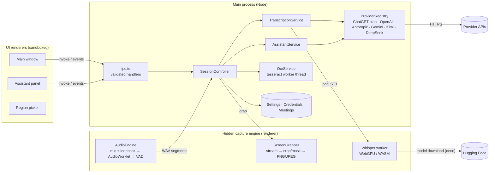

# Architecture

This document is the architecture proposal and implementation plan for MyCluely, updated to match what was built.

## 1. Goals and constraints

| Goal | Consequence for the design |
| --- | --- |
| Real-time help during live meetings on **Windows 11**, macOS later | Cross-platform desktop runtime with first-class Windows media capture; OS-specific code isolated behind ports. |
| Hear **both** sides of the conversation | Capture microphone and system (loopback) audio as separate channels, which also gives "You" vs "Remote" speaker labels for free. |
| Understand the **screen** | Screen/window/region frame grabbing + local OCR + optional vision models. |
| Five AI providers plus ChatGPT plan sign-in, user-selectable, switchable mid-meeting | Provider-neutral request model; the app (not the provider) owns conversation state. |
| Responsive during long meetings | All heavy work off the UI thread; bounded queues; context compaction. |
| Trustworthy | Grounded prompts, explicit uncertainty, OS-encrypted keys, least-privilege IPC, local data with retention. |

## 2. Technology choices

| Concern | Choice | Why (and alternatives considered) |
| --- | --- | --- |
| Desktop shell | **Electron 44** + TypeScript | Chromium ships the media stack we need on Windows: WASAPI loopback via `getDisplayMedia` + `setDisplayMediaRequestHandler`, Windows Graphics Capture via `desktopCapturer`, AudioWorklet, WebGPU. One codebase for Windows and macOS. *Tauri* would need custom Rust capture code per OS and has no WebGPU/AudioWorklet parity in WebView2/WKWebView for our use; *WinUI/.NET* is Windows-only. |
| UI | **React 19** + plain CSS (design tokens) | Small, fast, no CSS framework runtime. |
| Build | **electron-vite 5 / Vite 7**, electron-builder 26 | Fast HMR in dev; electron-vite 5 supports Vite ≤ 7 (Vite 8 needs a beta). TypeScript 5.9 for full tooling compatibility. |
| Audio capture | Hidden "capture engine" renderer: `getUserMedia` (mic) + `getDisplayMedia` loopback (system audio) → **AudioWorklet** → resampler → **energy VAD** → 16 kHz WAV segments | Runs off the UI thread and independent of UI windows; no native modules. |
| Transcription | **On-device Whisper** (transformers.js 4, ONNX Runtime Web, WebGPU → WASM fallback) · **OpenAI** `/v1/audio/transcriptions` · **Gemini** audio input | Works without any key (local), or uses the user's provider. `auto` picks OpenAI → Gemini → local. Anthropic, Moonshot and DeepSeek have no speech-to-text API, so they rely on the other engines. |
| Screen capture | `desktopCapturer` (source list) + `getUserMedia(chromeMediaSource: desktop)` stream → OffscreenCanvas crop/mask/encode | Captures a chosen screen or window at native resolution, crops regions, masks our own windows, prepares a grayscale OCR image with dark regions inverted, and computes a 160×90 change signature. |
| OCR | **tesseract.js 7** in a Node worker thread, English LSTM model bundled | Offline, no credentials, never blocks the UI; confidence drives the readability rating. |
| AI integration | Official SDKs: `openai` (Responses API; also used for Kimi's and DeepSeek's official OpenAI-compatible endpoints), `@anthropic-ai/sdk` (Messages API), `@google/genai` (Gemini API) | Official APIs only, streaming everywhere, typed errors. |
| Persistence | JSON files in the user-data folder: `settings.json` (zod-validated), `credentials.json` (DPAPI-encrypted), per-meeting `meeting.json` + append-only `transcript.jsonl` | No native database driver to rebuild for Electron; JSONL append is crash-safe during long meetings; atomic writes for everything else. |
| Secrets | Electron **`safeStorage`** async API (Windows DPAPI; Keychain on macOS) | OS-backed encryption; keys never reach a renderer. |

## 3. Process model

- **Main process** owns all state, secrets and network calls to AI providers. Renderers never hold an API key.
- **Capture engine** is a hidden window with `backgroundThrottling: false`, so UI windows can be closed or reloaded without interrupting capture. If it crashes, the main process recreates it and re-issues the active capture command.
- **UI windows** are sandboxed, context-isolated, use a whitelisted preload bridge, and are served from a custom `app://` origin with a strict CSP and COOP/COEP (cross-origin isolation enables multi-threaded WASM for Whisper and gives a persistent origin for the model cache).

## 4. Components

| Component | File(s) | Responsibility |
| --- | --- | --- |
| SessionController | `src/main/session/controller.ts` | Meeting lifecycle (start/pause/resume/stop), capture status, segment handling (speaker labels, hallucination and echo filtering), question tracking, screen capture pipeline (masking, change detection, OCR, quality), persistence, final summary. **No Electron imports** — exercised headlessly in tests. |
| LiveMeeting | `src/main/session/live-meeting.ts` | In-memory meeting record (ordered transcript, responses, snapshots, questions, rolling summary). |
| Ports | `src/main/session/ports.ts` | Interfaces for the OS-specific parts: `CaptureDriver`, `ScreenSourceProvider`, `Broadcaster`. |
| TranscriptionService | `src/main/transcription/service.ts` | Engine resolution (auto/local/OpenAI/Gemini), 2-way concurrency, retries with back-off, timeout handling, backlog merging, auto fallback to on-device Whisper. |
| AssistantService | `src/main/assistant/assistant.ts` | Actions, streaming with delta batching, cancel/regenerate/refine, auto-answer scheduling (settle delay, one answer at a time, cooldown that defers rather than drops questions, 90 s staleness limit), quiet screen answers (hidden unless the model has something to answer — a reply of `NOTHING_TO_ANSWER` never shows), rolling summary compaction. |
| ScreenWatcher | `src/main/session/screen-watcher.ts` | Auto answer mode for the screen: a change probe every 1.2 s (signature only, no image encoding), read once the screen has been still for 1 s (or, for screens that never stop moving, every 3 s until the text reads the same twice), dedupe by *new words* against everything already answered, local `looksAnswerable` check before any model request, unreadable captures reported unless the model sees the image. Runs only in Auto mode, while a meeting is running, not paused, with a source selected. |
| Context builder & prompts | `src/shared/context.ts`, `src/shared/prompts.ts` | Token-budgeted prompt assembly; mode and style instructions; grounding and uncertainty rules. |
| Providers | `src/main/providers/*` | One adapter per provider on its official SDK; capability discovery; parameter fallbacks; error normalisation. |
| Stores | `src/main/services/*` | Settings (zod with per-field fallbacks), DPAPI credentials, meeting store with retention. |
| Window manager / IPC / protocol | `src/main/windows.ts`, `ipc.ts`, `app-protocol.ts`, `capture-driver.ts` | Windows, permissions, sender-checked IPC, `app://` protocol, capture bridge. |
| Capture engine | `src/renderer/src/capture/*` | AudioWorklet capture, VAD segmentation, device-change recovery, screen grabbing, Whisper worker. |
| UI | `src/renderer/src/main/*`, `overlay/*`, `components/*` | Main window, assistant panel, settings, history; a tiny external store fed by IPC events. |

## 5. Data flows

**Audio → transcript**

1. Mic and loopback streams each feed an AudioWorklet that posts 100 ms mono blocks.
2. Blocks are resampled to 16 kHz and run through an adaptive-noise-floor VAD, which emits utterances (pre-roll, post-roll; long monologues split at the quietest point; max 14 s by default).
3. Each utterance is encoded as WAV and sent to the main process with its channel and wall-clock start.
4. TranscriptionService transcribes it (local, OpenAI or Gemini) with recent transcript as a continuity hint.
5. SessionController drops known hallucinations ("Thank you.", "[BLANK_AUDIO]") and microphone segments that repeat what a remote speaker just said (speaker echo), labels the speaker, inserts in time order, appends to `transcript.jsonl`, updates the question tracker and broadcasts.

**Screen → context**

1. The user picks a screen, a window or a region.
2. On a manual or automatic trigger, the capture engine grabs a frame and crops it. Our own visible windows are blacked out (unless the OS already excludes them).
3. It produces:
   - a lossless OCR image: upscaled, grayscale, with dark regions (dark themes, terminals) inverted tile by tile so text is always dark on light
   - a JPEG of at most 1600 px for vision models
   - a thumbnail
   - a 160×90 grayscale change signature and a blankness score
4. An automatic capture is skipped only when less than 0.15% of its signature pixels changed. That is fine enough to catch a new slide with the same template, scrolling or edited code, while ignoring a moving cursor. (A coarse 9×8 hash used earlier missed same-layout slide changes.)
5. Tesseract's word-level output is cleaned: junk read from icons, borders and toolbars is dropped, and lines that are mostly junk are dropped entirely. The rating comes from the share of remaining text read with high confidence: **clear** at 75% or more, **partial** at 45% or more, otherwise **unreadable**. It is shown with a note ("blank — window minimised?", "low contrast") in the UI and quoted in prompts.

**Assistant request**

1. The context builder assembles a fresh prompt for every action:
   - system prompt: rules, meeting mode, response style, the user's context and custom instructions
   - meeting header
   - rolling summary of early discussion
   - newest transcript lines that fit the budget
   - latest relevant screen OCR with its quality
   - the last few assistant responses
   - the task
2. The screenshot is attached only when the model supports images and the image policy allows it. The default *automatic* policy attaches it for *Explain this screen*, and for other actions when the latest capture is under 2 minutes old and its OCR is not rated clear.
3. The selected provider streams deltas; the main process batches them every 40 ms and the UI renders progressively.
4. Notes such as "Answered by fallback model" are shown under the answer. Screen-quality warnings appear only on screen explanations that had to rely on OCR text alone.

Because the app owns this state and every request is self-contained, switching provider or model mid-meeting needs no migration.

## 6. Long meetings and context limits

- The prompt budget is `min(Max context setting, 80% of the model's context window − output reserve)`. The transcript fills what is left, newest first.
- When the unsummarised transcript exceeds 60% of the budget, the oldest half is folded into a running summary in the background. Prompts then carry *summary + recent verbatim lines*, so cost and latency stay flat over hours.
- Transcription keeps up through bursts: 2 concurrent requests, and when the queue grows, consecutive segments from the same speaker are merged into longer requests instead of dropping audio.
- Memory is bounded:
  - at most 300 screen captures, with preview images only for the most recent 20
  - audio is never retained after transcription
  - the UI uses `content-visibility` for long transcripts

## 7. Providers and capabilities

Each adapter implements `listModels()` and `stream()`; OpenAI and Gemini also implement `transcribe()`. Capability discovery avoids hard-coded model lists:

| Provider | Model list & metadata | Vision | Reasoning / latency control | Notes |
| --- | --- | --- | --- | --- |
| ChatGPT plan | `GET /v1/models` with the OAuth token (`slug`, `display_name`, `visibility`) | name heuristic + user override | `reasoning.effort` (dropped if unsupported) | “Sign in with ChatGPT”: OIDC + PKCE via the system browser, loopback callback on 127.0.0.1:1455, dynamic client registration, ID token verified against the issuer’s JWKS, refresh with rotation, revocation on sign-out. Requests use `/v1/responses` with `store: false`; unsupported inputs (e.g. images) are dropped and retried; plan-usage error codes map to actionable messages. |
| OpenAI | `GET /v1/models` (ids only) | name heuristic + user override | `reasoning.effort` none → minimal → low → omitted at *Fastest* (the first value a model accepts is remembered); low/medium at *Balanced* | Responses API, `store: false`, instructions as `instructions`. |
| Anthropic | Models API: `max_input_tokens`, `max_tokens`, `capabilities.image_input`, `capabilities.effort` | from API | `output_config.effort` when supported; adaptive thinking left at model default | Server-side refusal fallback (`fallbacks: "default"`) on models that support it, with automatic retry without it otherwise; `refusal` stop reason surfaced. |
| Gemini | `models.list` with token limits | Gemini models are multimodal | `thinkingLevel` with automatic step-down (MINIMAL → LOW → none) when a model rejects a level | Also transcribes audio. |
| Moonshot (Kimi) | `GET /v1/models` incl. `context_length`, `supports_image_in` | from API | K2.x `thinking` on/off, K3 `reasoning_effort` | No sampling params sent (Kimi rejects non-default values); `max_completion_tokens` with `max_tokens` fallback. |
| DeepSeek | `GET /models` incl. `context_window`, `max_output_tokens`, `input_modalities` | from API | `thinking` disabled for short answers; enabled with `reasoning_effort: low` for detailed ones | Reasoning text (`reasoning_content`) is not shown; image and thinking parameters dropped and retried if a model rejects them. Shares the Chat Completions streaming helper with Kimi. |

When the selected model cannot see images, the screen is described with OCR text and the answer carries a note. Provider errors are normalised into actionable messages: bad key, quota, rate limit with retry-after, network, timeout, model not found, context too long, refusal. Transient errors are retried once before any output has streamed.

**Appearance.** Themes, accents and style options are CSS custom properties keyed off attributes on `<html>` (`data-theme`, `data-accent`, `data-density`, `data-corners`, `data-font`); accents are `light-dark()` pairs so one accent works on every theme, and theme blocks also apply to any element (the live previews in Settings). The main process resolves *System* against the Windows app mode, sets `nativeTheme.themeSource` to the theme's scheme (title bar, menus, form controls), paints window backgrounds to match, and forwards the Windows accent colour, from which the renderer derives shades that keep 4.5:1 contrast.

**Latency.** Requests never wait on model metadata (a cache miss refreshes in the background and the request uses heuristics). An `undici` agent (pinned to the version bundled with Electron's Node) keeps provider connections alive for 60 s instead of Node's 4 s default — none of the provider APIs send a `Keep-Alive` hint, so without it nearly every answer paid a new TCP + TLS handshake (≈0.4 s on a 180 ms round trip). Connections are opened ahead of time when a meeting starts and when a question is detected. Prompts put the summary and the append-only transcript first and per-request details (time, screen, history, task) last, so providers with prefix caching can reuse work between requests. Each response records `firstTokenMs` and `totalMs`.

## 8. Security and privacy model

- **Renderers:** `contextIsolation`, `sandbox`, no Node, navigation and new windows blocked, `<webview>` blocked, strict CSP. Network access is limited to Hugging Face for the Whisper model download.
- **IPC:** a single whitelisted bridge. Every handler checks that the sender is one of our UI windows (capture and region channels are checked separately) and validates its arguments.
- **Permissions:** media/display-capture is granted only to the hidden capture engine. Loopback audio is granted only to that engine's frame. All other permission requests are denied.
- **Secrets:** API keys and the ChatGPT sign-in session are encrypted with DPAPI via `safeStorage`. The UI sees only "configured" plus the last four characters (or the signed-in account email). Keys are read from environment variables as a read-only fallback.
- **Data:**
  - Audio stays in memory only.
  - Screenshots are deleted at meeting end unless kept by choice.
  - History is local, with configurable retention, and can be turned off or deleted.
  - A consent reminder is shown before capture.
  - The optional "hide from capture" setting excludes MyCluely windows from screen sharing via `setContentProtection`.
- **Shortcuts:** only the panel toggle is global at all times. Action shortcuts are registered only during a live meeting, and the defaults avoid AltGr and common meeting-app shortcuts.

## 9. Failure handling

| Failure | Behaviour |
| --- | --- |
| No API key / bad key / quota | Response card shows the actionable error; a toast links to Settings; transcription in `auto` falls back to on-device Whisper. |
| Rate limit / 5xx / network | Exponential back-off with `retry-after`; transcription retried up to 3×, answers once (only before streaming starts). |
| Model lacks a feature (reasoning param, thinking level, refusal fallback, image input) | Parameter dropped and request retried; image replaced by OCR text with a note. |
| Model/endpoint not found | Clear message; Settings shows the live model list and flags a selected model that is missing. |
| Context too long | Budgeting prevents it; if it still happens the user is told to lower *Max context*. |
| Microphone unplugged / device changed | Track end detected, up to 3 reconnect attempts with back-off, fallback to the default device with a status message. |
| System audio unavailable | Channel shows an error; microphone capture continues. |
| Window closed / minimised / protected content | Capture error or "blank capture" quality note; auto-capture keeps trying the chosen source. |
| Capture engine crash | Recreated automatically; the active capture is restored. |
| App crash mid-meeting | Transcript lines already persisted (JSONL append); torn last line is ignored on load. |
| Global shortcut taken by another app | Reported once with the conflicting shortcut. |

## 10. macOS roadmap

The OS-specific surface is small and isolated:
- `ElectronScreenSources` handles screen and window discovery.
- The display-media handler in `main/index.ts` grants loopback audio.
- `safeStorage` uses the Keychain on macOS.

For macOS:
1. Add `NSMicrophoneUsageDescription` and `NSAudioCaptureUsageDescription` (already in `electron-builder.yml`).
2. Use `useSystemPicker` on macOS 15+ for loopback (known Electron issue with custom handlers).
3. Request Screen Recording permission.
4. Sign and notarise.

No changes are needed in the session, transcription, assistant or UI layers.

## 11. Implementation plan (as executed)

1. **Foundations.** Project scaffolding (electron-vite, strict TypeScript), shared domain types and the IPC contract, settings schema, DPAPI credential store, meeting store.
2. **Conversation core (pure TypeScript, unit-tested).**
   - Audio: resampler, VAD segmenter and WAV codec.
   - Transcript filters and question detection.
   - Prompts, the context builder with token budgeting and rolling-summary planning, summary parsing, export.
3. **Providers.** OpenAI, Anthropic, Gemini, Moonshot and DeepSeek adapters on the official SDKs; registry; error mapping; verified against a wire-compatible mock server, then against real Anthropic and Gemini APIs.
4. **Orchestration.** TranscriptionService, AssistantService and SessionController behind ports; headless integration tests of the full meeting workflow with real OCR.
5. **Capture engine.** AudioWorklet pipeline, loopback audio, device recovery, screen grabber with masking and change detection, on-device Whisper worker (WebGPU/WASM).
6. **Desktop shell.** Window manager, `app://` protocol with CSP and isolation, permissions, IPC, shortcuts, tray.
7. **UI.** Main window, assistant panel, settings, history and export; consent reminder.
8. **Verification and packaging.**
   - Playwright E2E against the dev build and the packaged app.
   - Opt-in real Whisper test, real-provider runs.
   - NSIS installer and portable exe; documentation.
